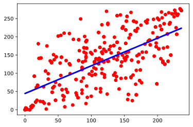

```python
import pandas as pd
import numpy as np
import matplotlib.pyplot as plt
```


```python
bac =  pd.read_csv("student_bac_path.csv")
algo =  pd.read_csv("result_clean.csv")
algo.info()
```

    <class 'pandas.core.frame.DataFrame'>
    RangeIndex: 1762 entries, 0 to 1761
    Data columns (total 6 columns):
    id_student      1762 non-null int64
    algo_one        1762 non-null float64
    algo_two        1762 non-null float64
    current_year    1762 non-null int64
    study_level     1762 non-null object
    status          1762 non-null object
    dtypes: float64(2), int64(2), object(2)
    memory usage: 82.7+ KB
    


```python
# drop status level and current year from bac data set
algo = algo.drop(columns=['id_student','current_year', 'study_level', 'status'])
algo.info()
```

    <class 'pandas.core.frame.DataFrame'>
    RangeIndex: 1762 entries, 0 to 1761
    Data columns (total 2 columns):
    algo_one    1762 non-null float64
    algo_two    1762 non-null float64
    dtypes: float64(2)
    memory usage: 27.7 KB
    


```python
X = algo['algo_one']
Y = algo['algo_two']

from sklearn.preprocessing import LabelEncoder
label = LabelEncoder()
X = label.fit_transform(X).reshape(-1, 1)
Y = label.fit_transform(Y)

```


```python
#split data into train and test data
from sklearn.model_selection import train_test_split
x_train , x_test , y_train , y_test = train_test_split(X,Y , test_size = 0.2 , random_state = 90)
```


```python
#predict and train 
from sklearn.linear_model import LinearRegression
reg = LinearRegression().fit(x_train, y_train)
pred = reg.predict(x_test)
```


```python
#evaluate model
from sklearn.metrics import r2_score
print("slope ",reg.coef_)
print("intercept ",reg.intercept_)
print("r2 score ",r2_score(y_test,pred,multioutput='variance_weighted'))
```

    slope  [0.75836973]
    intercept  44.63454579953424
    r2 score  0.41306722135529694
    


```python
plt.scatter(x_test,y_test, color="red")
plt.plot(x_test,pred, color="blue", linewidth=3)
plt.show()
```





```python

```
