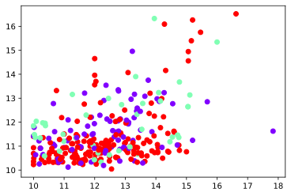
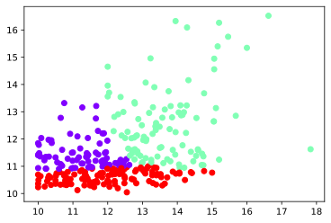

```python
import matplotlib.pyplot as plt
import seaborn as sns
```


```python
from prepareData import prepare
data_x,  data_y, X, Y = prepare()
```

    gender nationality  age  bac_wilaya  bac_average  repeated  semsters_avg
    0      M  algérienne   22          14        12.20      True     10.458333
    1      M  algérienne   26          14        10.37     False     10.315000
    2      M  algérienne   22          14        11.49      True     10.296667
    3      M  algérienne   25          14        11.44     False     11.178333
    4      M  algérienne   23          14        10.50     False     10.358333
    


```python
plt.scatter( data_x['bac_average']  ,data_x['semsters_avg'] , c = Y, cmap='rainbow')
plt.show()

```





```python
from sklearn.cluster import KMeans
# kmeans
kmean = KMeans(n_clusters=3, random_state=0)

clusters = X
pred=kmean.fit_predict(X)
```


```python
plt.scatter(data_x['bac_average'], data_x['semsters_avg'], c = pred, cmap='rainbow')
plt.show()

```





```python
#evaluate clusetring 
from sklearn import metrics
kmean_metric = metrics.adjusted_rand_score(Y, pred)
kmean_metric
```


    0.05230902163579889


